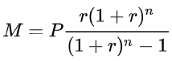

# Mortgage-Calculator
In order to calculate the monthly payment, we can rely on a relatively simple equation. The monthly payment equation can be represented as follows:

These variables represent the following inputs:
M is your monthly payment.
P is your principal.
r is your monthly interest rate, calculated by dividing your annual interest rate by 12.
n is your number of payments (the number of months you will be paying the loan)
